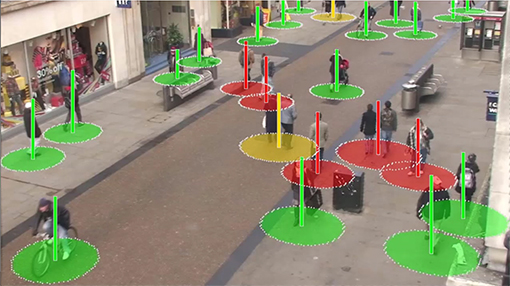

# DeepSOCIAL: Social Distancing Monitoring and Infection Risk Assessment in COVID-19 Pandemic 
**REFERENCE:** 

**Mahdi Rezaei, Mohsen Azarmi. [2020] DeepSOCIAL: Social Distancing Monitoring and Infection Risk Assessment in COVID-19 Pandemic, Applied Sciences, MDPI, 10(21), 7514.** 

**Open access paper:** https://www.mdpi.com/2076-3417/10/21/7514    &    https://doi.org/10.3390/app10217514

 

## Guideline to Run the Code:
____________________________________
### Option 1: Online Execution on Colab

The code can be executed in Google Colab by following the guideline below:
1. Click on the YOLO4_DeepSOCIAL-1.ipynb and open it in Colab via the given link
2. Follow Steps i, ii, and iii to setup the GPU accelerator 
3. Run the Cloning cell only. A *darkenet* folder will be generated under the *content* folder (i.e. \content\darknet\...)
5. Download the following files and paste them in the **darknet** folder of your Google Colab 
     
   - Oxford Town Dataset: https://drive.google.com/file/d/1UMIcffhxGw1aCAyztNWlslHHtayw9Fys/view
   - Optimised DeepSOCIAL weights: https://drive.google.com/file/d/1t5OgqRn-s6TFZp1X3L5g4zMfaK0OqcEt/view
   - DeepSocial.pyc: https://drive.google.com/file/d/1l8ffoJ_XsUGluhAI5ViMaK7lAolkX8un/view
   - Sort.py: https://drive.google.com/file/d/1Cfz1ELlAi9iprM4-nKLrG9v1H_VzX5XW/view
   
 
6. Press Ctrl+F10 or "Run after" under the Runtime menu. The program should continue running and finishes by generating three processed 3 video output files in the **darknet** folder as follows:
    * /content/darknet/DeepSOCIAL DTC.avi
    * /content/darknet/DeepSOCIAL Social Distancing.avi
    * /content/darknet/DeepSOCIAL Crowd Map.avi
    
____________________________________
### Option 2: Shared Google Drive and Colab Execution

In this method you can keep those large files in your own google driver; so, you would not need to upload them for every new session in your Google Colab darknet folder. 
1. Make a folder named **DeepSOCIAL** in the root of your Google Drive.
2. Copy the following files in the DeepSOCIAL folder
   - Oxford Town Dataset: https://drive.google.com/file/d/1UMIcffhxGw1aCAyztNWlslHHtayw9Fys/view
   - Optimised DeepSOCIAL weights: https://drive.google.com/file/d/1t5OgqRn-s6TFZp1X3L5g4zMfaK0OqcEt/view
   - DeepSocial.pyc: https://drive.google.com/file/d/1l8ffoJ_XsUGluhAI5ViMaK7lAolkX8un/view
   - Sort.py: https://drive.google.com/file/d/1Cfz1ELlAi9iprM4-nKLrG9v1H_VzX5XW/view
      
3. Click on the YOLOv4_DeepSOCIAL_LoadfromDrive-1.ipynb and open it in Google Colab via the given link
4. Click on "Run all" under the Runtime menu or use the Ctrl+F9 shortcut.
5. At the begining of the execution the code requires to access the required files by mounting your Google Drive. Click on the provided link, copy the generated code by Google, and paste it in the next line within the given box. This way the above four required files will be directly accessed via your Google drive.
6. The program would keep running and ends by generating 3 output video files in **darknet** folder, as follows:
    * /content/darknet/DeepSOCIAL DTC.avi
    * /content/darknet/DeepSOCIAL Social Distancing.avi
    * /content/darknet/DeepSOCIAL Crowd Map.avi
